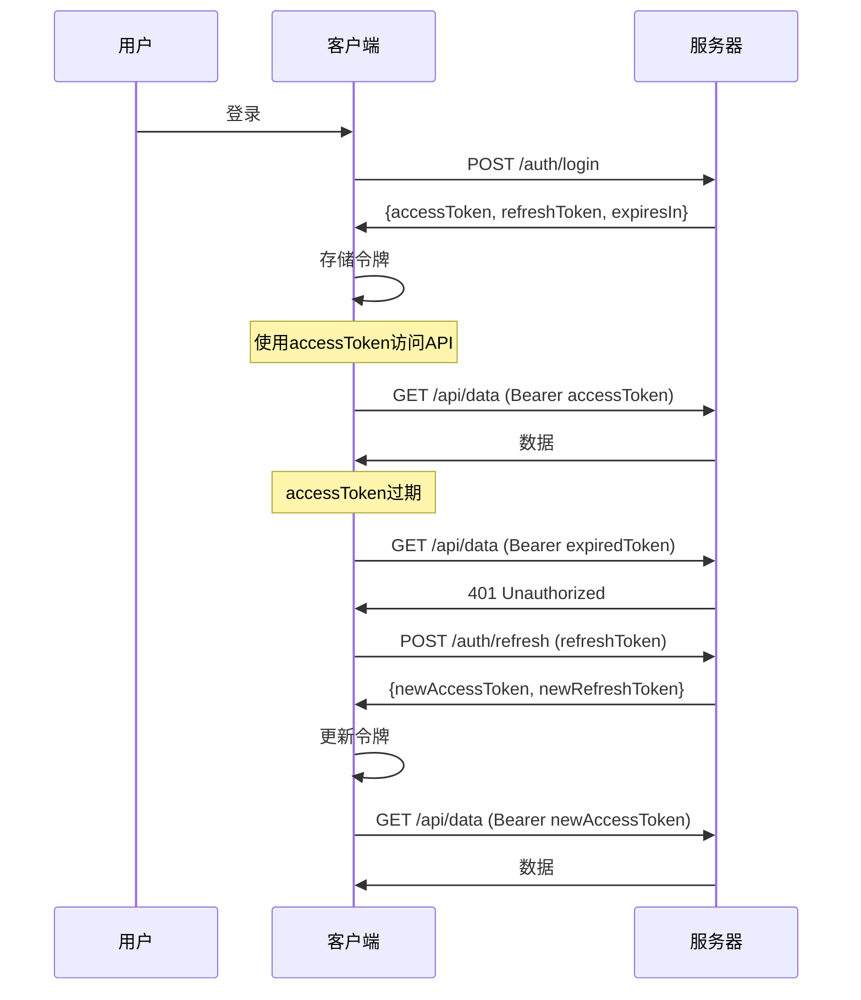

# RefreshToken 使用指南

## 🔐 **什么是RefreshToken？**

RefreshToken是一种安全机制，用于在访问令牌（AccessToken）过期后自动获取新的访问令牌，而无需用户重新登录。

## 🎯 **为什么需要RefreshToken？**

### **安全性考虑**
- **AccessToken**：有效期短（15分钟-1小时），减少被盗用的风险
- **RefreshToken**：有效期长（7天-30天），但使用频率低，相对安全
- 即使AccessToken被盗，攻击者也只能在短时间内使用

### **用户体验**
- 用户无需频繁重新登录
- 自动处理令牌过期
- 无缝的API访问体验

## 🔄 **工作流程**



## 📝 **数据结构**

### **登录响应**
```javascript
{
  "code": 200,
  "message": "登录成功",
  "data": {
    "user": {
      "id": 1,
      "username": "admin",
      "nickname": "管理员",
      "email": "admin@example.com",
      "avatar": "https://example.com/avatar.jpg"
    },
    "token": "eyJhbGciOiJIUzI1NiIsInR5cCI6IkpXVCJ9...", // AccessToken
    "refreshToken": "eyJhbGciOiJIUzI1NiIsInR5cCI6IkpXVCJ9...", // RefreshToken
    "expiresIn": 3600 // AccessToken过期时间（秒）
  }
}
```

### **刷新令牌响应**
```javascript
{
  "code": 200,
  "message": "Token刷新成功",
  "data": {
    "token": "eyJhbGciOiJIUzI1NiIsInR5cCI6IkpXVCJ9...", // 新的AccessToken
    "refreshToken": "eyJhbGciOiJIUzI1NiIsInR5cCI6IkpXVCJ9...", // 新的RefreshToken（可选）
    "expiresIn": 3600 // 新的过期时间
  }
}
```

## 🛠️ **实现方式**

### **1. Token管理工具类**

```javascript
// src/utils/tokenManager.js
import { tokenManager } from '@/utils/tokenManager'

// 设置令牌
tokenManager.setTokens(accessToken, refreshToken, expiresIn)

// 获取有效令牌（自动刷新）
const validToken = await tokenManager.getValidAccessToken()

// 手动刷新令牌
const newToken = await tokenManager.refreshAccessToken()

// 清除所有令牌
tokenManager.clearTokens()
```

### **2. 请求拦截器自动处理**

```javascript
// src/api/requestWithRefresh.js
// 自动添加访问令牌，处理401错误并刷新令牌
import { httpWithRefresh } from '@/api/requestWithRefresh'

// 使用带自动刷新的请求
const data = await httpWithRefresh.get('/api/user/info')
```

### **3. 用户Store集成**

```javascript
// src/stores/userWithRefresh.js
import { useUserStoreWithRefresh } from '@/stores/userWithRefresh'

const userStore = useUserStoreWithRefresh()

// 登录
await userStore.login({ username: 'admin', password: '123456' })

// 自动处理令牌刷新
await userStore.initUser()
```

## 💡 **使用示例**

### **在Vue组件中使用**

```javascript
<template>
  <div>
    <div v-if="userStore.isLoggedIn">
      欢迎，{{ userStore.user.nickname }}！
    </div>
    <div v-else>
      <button @click="handleLogin">登录</button>
    </div>
  </div>
</template>

<script setup>
import { useUserStoreWithRefresh } from '@/stores/userWithRefresh'
import { onMounted } from 'vue'

const userStore = useUserStoreWithRefresh()

// 组件挂载时初始化用户信息
onMounted(async () => {
  await userStore.initUser()
})

const handleLogin = async () => {
  const result = await userStore.login({
    username: 'admin',
    password: '123456'
  })
  
  if (result.success) {
    console.log('登录成功:', result.user)
  } else {
    console.error('登录失败:', result.message)
  }
}
</script>
```

### **在API调用中使用**

```javascript
// 使用带自动刷新的请求
import { httpWithRefresh } from '@/api/requestWithRefresh'

export const userApi = {
  async getUserInfo() {
    try {
      // 自动处理令牌刷新
      const response = await httpWithRefresh.get('/user/info')
      return response.data
    } catch (error) {
      console.error('获取用户信息失败:', error)
      throw error
    }
  }
}
```

## ⚠️ **注意事项**

### **1. 安全性**
- RefreshToken应该存储在HttpOnly Cookie中
- 设置合适的SameSite属性
- 使用HTTPS传输
- 定期轮换RefreshToken

### **2. 错误处理**
- 处理网络错误
- 处理令牌过期
- 处理刷新失败
- 自动跳转到登录页

### **3. 并发控制**
- 避免同时发起多个刷新请求
- 使用队列处理并发请求
- 确保只有一个刷新操作在进行

## 🔧 **配置选项**

### **环境变量**
```env
# .env.development
VITE_ACCESS_TOKEN_EXPIRES_IN=3600  # 1小时
VITE_REFRESH_TOKEN_EXPIRES_IN=604800  # 7天
```

### **Token配置**
```javascript
// src/config/token.js
export const TOKEN_CONFIG = {
  ACCESS_TOKEN_KEY: 'accessToken',
  REFRESH_TOKEN_KEY: 'refreshToken',
  ACCESS_TOKEN_EXPIRES_IN: 3600, // 1小时
  REFRESH_TOKEN_EXPIRES_IN: 604800, // 7天
  AUTO_REFRESH_THRESHOLD: 300 // 提前5分钟刷新
}
```

## 🚀 **最佳实践**

1. **自动刷新**：在令牌即将过期时自动刷新
2. **错误处理**：优雅处理各种错误情况
3. **用户体验**：避免频繁的登录提示
4. **安全性**：使用安全的存储方式
5. **监控**：记录令牌使用情况

## 📊 **监控和调试**

```javascript
// 添加调试信息
console.log('当前访问令牌:', tokenManager.getAccessToken())
console.log('当前刷新令牌:', tokenManager.getRefreshToken())
console.log('令牌是否过期:', tokenManager.isAccessTokenExpired())

// 监听令牌刷新事件
tokenManager.on('tokenRefreshed', (newToken) => {
  console.log('令牌已刷新:', newToken)
})
```

通过使用RefreshToken机制，您可以提供更安全、更流畅的用户体验，同时保持API访问的安全性。
