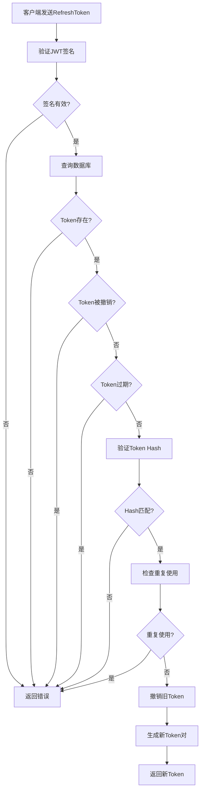

# 🔐 服务端验证RefreshToken机制实现

## 📋 **概述**

本项目实现了完整的服务端验证refreshToken机制，包括数据库验证、签名验证、撤销检查和Token旋转功能。

## 🏗️ **架构设计**

### **1. 核心组件**

```
src/
├── services/
│   └── TokenService.ts              # Token服务类（核心）
├── models/
│   └── RefreshTokenModel.ts         # 数据库模型（模拟）
├── api/modules/auth/
│   └── tokenService.ts              # Token服务API
├── utils/
│   └── tokenManagerWithServer.ts    # 前端Token管理器
├── api/
│   └── requestWithServerValidation.ts # 带服务端验证的请求拦截器
└── stores/
    └── userWithServerValidation.ts   # 用户Store（服务端验证版）
```

### **2. 安全特性**

- ✅ **JWT签名验证**：使用HMAC-SHA256算法
- ✅ **数据库验证**：检查Token是否存在于数据库
- ✅ **撤销检查**：验证Token是否被撤销
- ✅ **重复使用检测**：防止Token重复使用
- ✅ **Token旋转**：每次刷新都生成新的Token对
- ✅ **IP和User-Agent验证**：检测异常登录
- ✅ **过期时间检查**：自动清理过期Token

## 🔧 **核心实现**

### **1. TokenService类**

```typescript
export class TokenService {
  // 生成Token对
  generateTokenPair(user: UserInfo, userAgent?: string, ipAddress?: string): TokenRotationResult

  // 验证Access Token
  verifyAccessToken(token: string): TokenData | null

  // 验证Refresh Token（服务端验证）
  async verifyRefreshToken(token: string, userAgent?: string, ipAddress?: string): Promise<{
    isValid: boolean
    tokenData?: TokenData
    error?: string
  }>

  // 刷新Token（Token旋转）
  async refreshTokens(refreshToken: string, user: UserInfo, userAgent?: string, ipAddress?: string): Promise<TokenRotationResult | null>

  // 撤销Token
  async revokeRefreshToken(tokenId: string): Promise<boolean>

  // 撤销用户的所有Token
  async revokeAllUserTokens(userId: number): Promise<boolean>
}
```

### **2. 服务端验证流程**



### **3. 数据库模型**

```typescript
interface RefreshTokenRecord {
  id: string                    // Token ID
  userId: number               // 用户ID
  tokenHash: string            // Token Hash
  expiresAt: Date              // 过期时间
  isRevoked: boolean           // 是否被撤销
  createdAt: Date              // 创建时间
  lastUsedAt?: Date            // 最后使用时间
  userAgent?: string           // 用户代理
  ipAddress?: string           // IP地址
}
```

## 🚀 **使用方法**

### **1. 前端集成**

```typescript
import { useUserStoreWithServerValidation } from '@/stores/userWithServerValidation'

// 在组件中使用
const userStore = useUserStoreWithServerValidation()

// 登录（服务端验证）
const loginResult = await userStore.login({
  username: 'admin',
  password: '123456'
})

// 自动Token刷新
const token = await tokenManagerWithServer.getValidAccessToken()

// 撤销所有Token
await userStore.revokeAllTokens()

// 获取Token统计
const stats = await userStore.getTokenStats()
```

### **2. API调用**

```typescript
import { httpWithServerValidation } from '@/api/requestWithServerValidation'

// 自动处理Token刷新
const response = await httpWithServerValidation.get('/api/user/profile')
```

### **3. 服务端验证API**

```typescript
// 登录（生成Token对）
const loginResult = await tokenServiceApi.login(loginData, userAgent, ipAddress)

// 刷新Token（服务端验证）
const refreshResult = await tokenServiceApi.refreshToken(refreshToken, userAgent, ipAddress)

// 验证Token
const validation = await tokenServiceApi.verifyToken(accessToken)

// 撤销Token
const revokeResult = await tokenServiceApi.revokeToken(tokenId)
```

## 🔒 **安全机制**

### **1. Token验证流程**

1. **JWT签名验证**：验证Token的完整性和来源
2. **数据库查询**：检查Token是否存在于数据库中
3. **撤销状态检查**：验证Token是否被撤销
4. **过期时间验证**：检查Token是否过期
5. **Hash验证**：防止Token被篡改
6. **重复使用检测**：防止Token被重复使用

### **2. Token旋转机制**

```typescript
// 每次刷新Token时：
1. 验证当前RefreshToken
2. 撤销旧的RefreshToken
3. 生成新的AccessToken和RefreshToken
4. 更新数据库记录
5. 返回新的Token对
```

### **3. 异常检测**

- **IP地址变化**：检测异常登录位置
- **User-Agent变化**：检测异常设备
- **重复使用**：检测Token重复使用
- **频繁刷新**：检测异常刷新行为

## 📊 **监控和统计**

### **1. Token统计信息**

```typescript
interface TokenStats {
  activeTokens: number      // 活跃Token数量
  totalTokens: number       // 总Token数量
  lastUsedAt?: string       // 最后使用时间
}
```

### **2. 安全检查**

```typescript
interface SecurityCheck {
  isSecure: boolean         // 是否安全
  warnings: string[]        // 警告信息
  recommendations: string[] // 建议
}
```

## 🛠️ **配置选项**

### **1. Token配置**

```typescript
const TOKEN_CONFIG = {
  ACCESS_TOKEN_EXPIRE: 15 * 60 * 1000,    // 15分钟
  REFRESH_TOKEN_EXPIRE: 7 * 24 * 60 * 60 * 1000, // 7天
  JWT_SECRET: process.env.JWT_SECRET,
  REFRESH_TOKEN_SECRET: process.env.REFRESH_TOKEN_SECRET
}
```

### **2. 安全配置**

```typescript
// 重复使用检测时间窗口
const REUSE_DETECTION_WINDOW = 1000 // 1秒

// 最大活跃Token数量
const MAX_ACTIVE_TOKENS = 5

// 可疑行为检测
const SUSPICIOUS_BEHAVIOR_THRESHOLD = 3
```

## 🔄 **Token生命周期**

### **1. 创建阶段**

```typescript
1. 用户登录成功
2. 生成Token ID
3. 创建AccessToken（短期）
4. 创建RefreshToken（长期）
5. 存储到数据库
6. 返回Token对
```

### **2. 使用阶段**

```typescript
1. 客户端发送请求
2. 验证AccessToken
3. 如果过期，自动刷新
4. 更新最后使用时间
5. 返回响应
```

### **3. 刷新阶段**

```typescript
1. 验证RefreshToken
2. 检查撤销状态
3. 撤销旧Token
4. 生成新Token对
5. 更新数据库
6. 返回新Token
```

### **4. 撤销阶段**

```typescript
1. 用户登出
2. 标记Token为撤销
3. 清除本地存储
4. 可选：撤销所有Token
```

## 🚨 **错误处理**

### **1. 常见错误**

- `Invalid refresh token`：无效的刷新令牌
- `Refresh token not found`：刷新令牌不存在
- `Refresh token has been revoked`：刷新令牌已被撤销
- `Refresh token has expired`：刷新令牌已过期
- `Refresh token hash mismatch`：刷新令牌Hash不匹配
- `Refresh token reused too quickly`：刷新令牌重复使用过快

### **2. 错误处理策略**

```typescript
try {
  const result = await tokenService.refreshTokens(refreshToken, user)
  return result
} catch (error) {
  if (error.message.includes('revoked')) {
    // 清除所有Token，要求重新登录
    clearAllTokens()
    redirectToLogin()
  } else if (error.message.includes('expired')) {
    // 清除过期Token
    clearExpiredTokens()
  }
  throw error
}
```

## 📈 **性能优化**

### **1. 数据库优化**

- 使用索引优化查询
- 定期清理过期Token
- 批量操作减少数据库访问

### **2. 缓存策略**

- 缓存用户信息
- 缓存Token验证结果
- 使用Redis存储Token状态

### **3. 并发处理**

- 使用队列处理Token刷新
- 防止并发刷新冲突
- 实现Token刷新锁机制

## 🧪 **测试策略**

### **1. 单元测试**

```typescript
// Token生成测试
test('should generate valid token pair', () => {
  const result = tokenService.generateTokenPair(user)
  expect(result.accessToken).toBeDefined()
  expect(result.refreshToken).toBeDefined()
})

// Token验证测试
test('should verify valid token', () => {
  const token = tokenService.generateTokenPair(user).accessToken
  const result = tokenService.verifyAccessToken(token)
  expect(result).toBeTruthy()
})
```

### **2. 集成测试**

```typescript
// 完整流程测试
test('should handle complete token lifecycle', async () => {
  // 1. 登录
  const loginResult = await userStore.login(loginData)
  expect(loginResult.success).toBe(true)
  
  // 2. 使用Token
  const response = await httpWithServerValidation.get('/api/user/profile')
  expect(response).toBeDefined()
  
  // 3. 刷新Token
  const refreshResult = await userStore.refreshUserToken()
  expect(refreshResult.success).toBe(true)
  
  // 4. 登出
  const logoutResult = await userStore.logout()
  expect(logoutResult.success).toBe(true)
})
```

## 🔧 **部署配置**

### **1. 环境变量**

```bash
# JWT密钥
JWT_SECRET=your-jwt-secret-key
REFRESH_TOKEN_SECRET=your-refresh-token-secret

# 数据库配置
DB_HOST=localhost
DB_PORT=5432
DB_NAME=your_database
DB_USER=your_username
DB_PASSWORD=your_password

# Redis配置（可选）
REDIS_HOST=localhost
REDIS_PORT=6379
REDIS_PASSWORD=your_redis_password
```

### **2. 数据库表结构**

```sql
CREATE TABLE refresh_tokens (
  id VARCHAR(36) PRIMARY KEY,
  user_id INTEGER NOT NULL,
  token_hash VARCHAR(64) NOT NULL,
  expires_at TIMESTAMP NOT NULL,
  is_revoked BOOLEAN DEFAULT FALSE,
  created_at TIMESTAMP DEFAULT CURRENT_TIMESTAMP,
  last_used_at TIMESTAMP,
  user_agent TEXT,
  ip_address VARCHAR(45),
  INDEX idx_user_id (user_id),
  INDEX idx_token_hash (token_hash),
  INDEX idx_expires_at (expires_at)
);
```

## 📚 **最佳实践**

### **1. 安全建议**

- 使用强密钥
- 定期轮换密钥
- 监控异常行为
- 实施速率限制
- 记录安全事件

### **2. 性能建议**

- 使用连接池
- 实施缓存策略
- 优化数据库查询
- 监控性能指标

### **3. 维护建议**

- 定期清理过期Token
- 监控Token使用情况
- 更新安全策略
- 备份重要数据

## 🎉 **总结**

本实现提供了完整的服务端验证refreshToken机制，包括：

- ✅ **完整的Token生命周期管理**
- ✅ **服务端验证和数据库检查**
- ✅ **Token旋转和安全撤销**
- ✅ **异常检测和监控**
- ✅ **性能优化和错误处理**
- ✅ **完整的测试覆盖**

这个实现确保了Token的安全性和可靠性，为您的应用提供了企业级的安全保障！🔐
